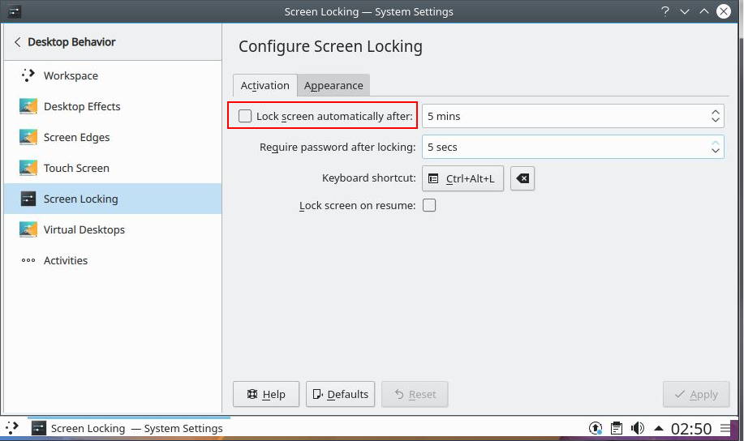

# Deploy an Ubuntu KDE VM with JMeter and X2GoServer

This template creates a Linux workstation as follows:

- Create a VM based on the Ubuntu 18.04-lts image 
- Installs KDE Plasma Desktop
- Installs JMeter 5.3
- Installs Azul Java 8
- Installs X2GoServer
- Installs Dolphin
- Installs Mozilla Firefox
- Installs Google Chrome
- Install Konsole
- Opens Port 9091

This template creates a new Ubuntu VM with KDE Standard desktop enabled. 

To connect, install [X2Go](https://wiki.x2go.org/doku.php)
Select KDE as Connection Type

On KDE Desktop, create a desktop shortcut to /opt/apache-jmeter-5.3/bin/jmeter.sh for running JMeter
 
[](https://portal.azure.com/#create/Microsoft.Template/uri/https%3A%2F%2Fraw.githubusercontent.com%2Fcodemonkeybot%2Fazure-quickstart-templates%2Fmaster%2Fjmeter-ubuntu-kde-desktop%2Fazuredeploy.json)  [](http://armviz.io/#/?load=https%3A%2F%2Fraw.githubusercontent.com%2Fcodemonkeybot%2Fazure-quickstart-templates%2Fmaster%2Fjmeter-ubuntu-kde-desktop%2Fazuredeploy.json)

# Running at terminal 

To open a terminal with Ctrl + Alt + t

# Troubleshooting Deployment

Login as root user to access /var/lib/waagent

```bash
sudo -i
```

The command output is also saved into this directory in stdout and stderr file.

```bash
cd /var/lib/waagent/custom-script/download/0/
```

# Disable KDE Screen Lock if using SSH public/private keys



### Microsoft Learn - Learning Modules

[Linux Virtual Machines on Azure](https://docs.microsoft.com/en-us/learn/browse/?term=Linux%20Virtual%20Machine)
